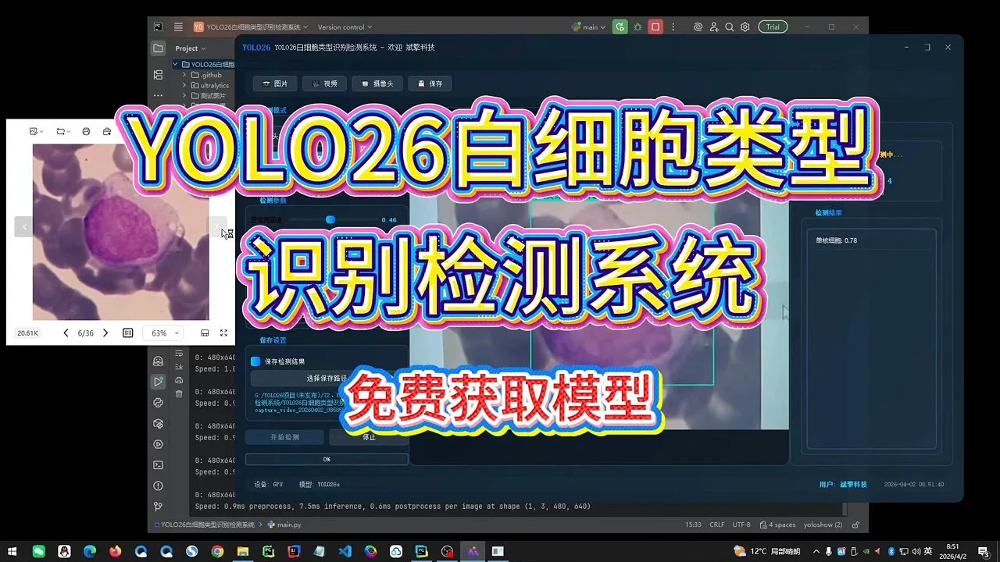
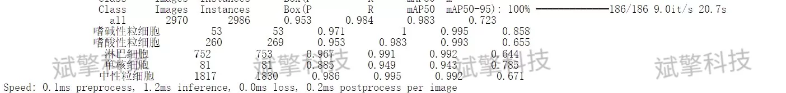
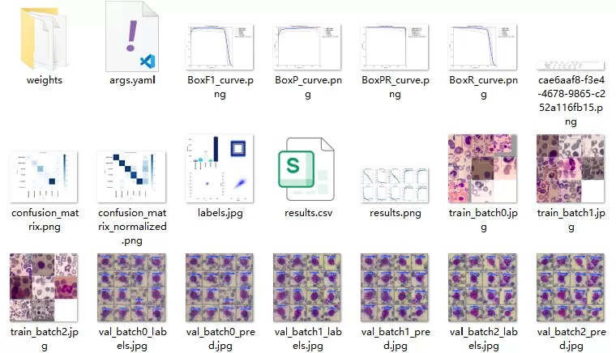
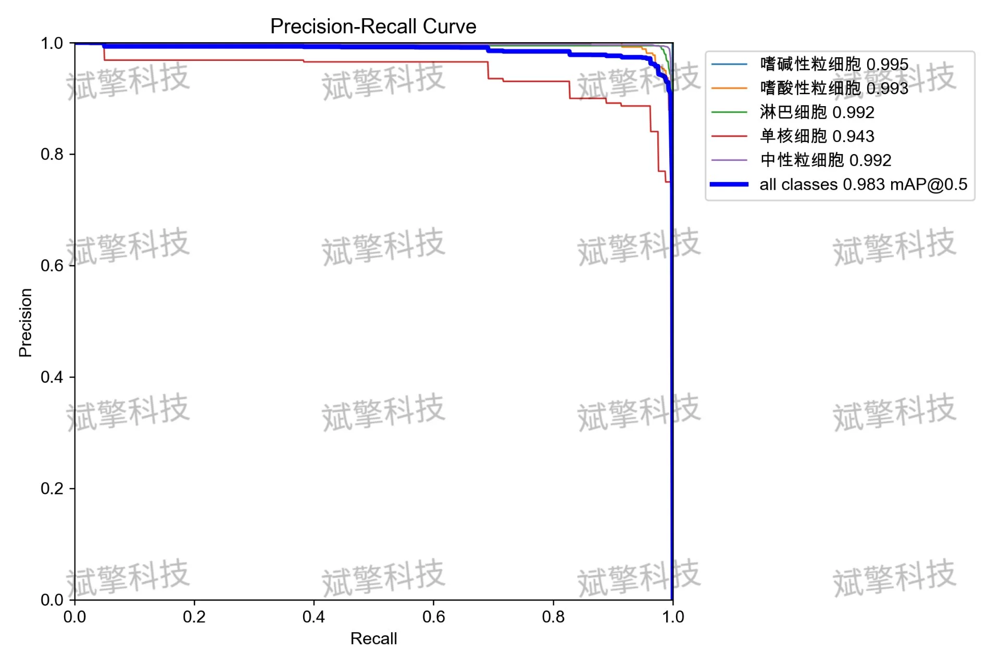
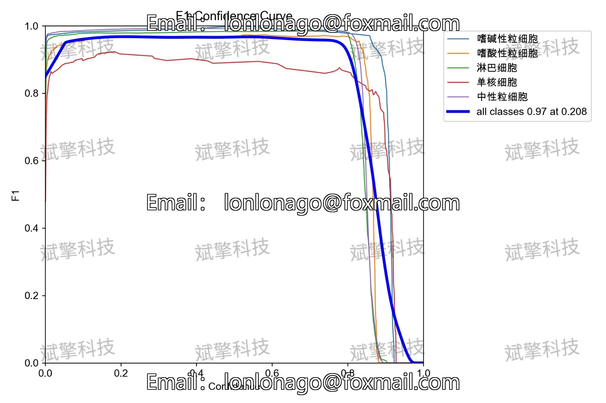
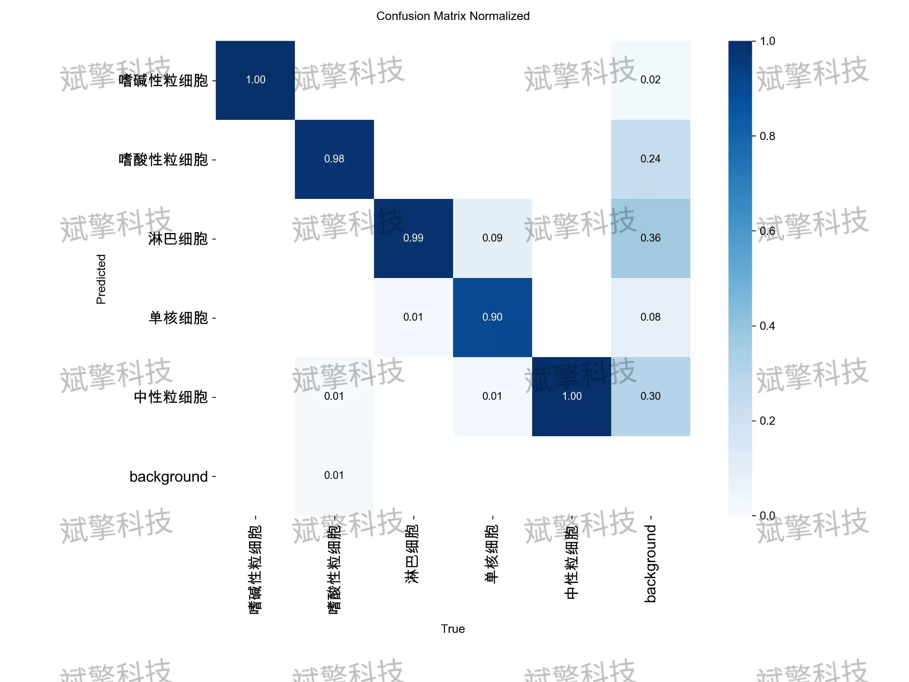
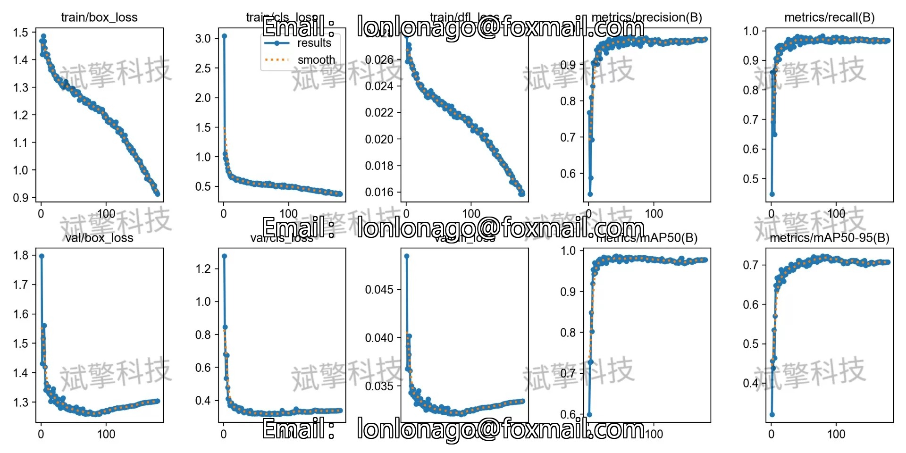

# YOLO26 Leukocyte Identification Detection System | Source Code

## Body

YOLO26 White Blood Cell Identification System | Source Code Based on YOLO26 Deep Learning for White Blood Cell Type Identification and Counting (Project Source Code + Dataset + Model Weights + UI Interface + Python + Deep Learning + Remote Deployment)

White blood cell classification counts are key in clinical hematology diagnosis, playing a significant role in the diagnosis of leukemia, infections, and immune system diseases. Traditional manual microscopic examination methods are time-consuming and rely on the experience of laboratory personnel. This paper proposes an automated white blood cell detection and classification system based on the YOLO26 (You Only Look Once) architecture. The system is trained to recognize five major types of white blood cells (basophils, eosinophils, lymphocytes, monocytes, neutrophils). Experimental results show that the model performs outstandingly on the validation set, with an average precision mean (mailto:mAP@0.5) reaching 98.3%, and the inference speed is extremely fast. Although there is a slight performance fluctuation in the mononuclear cell category with fewer samples, the overall system demonstrates great potential in assisting hematological diagnosis.

The dataset is divided into training and validation sets, with specific distributions as follows:
Training set: containing 6930 images for updating model weights and feature learning.
Validation set: containing 2970 images for monitoring the generalization ability of the model during training to prevent overfitting.
The class and annotation dataset contains 5 target categories corresponding to the five main white blood cells. The relationship between class ID and name is as follows:
0: Basophil (Basophilic Eosinophil)
1: Eosinophil (Eosinophilic Eosinophil)
2: Lymphocyte (Lymphocyte)
3: Monocyte (Monocytic Monocyte)
4: Neutrophil (Neutrophil)

Free reservation for remote installation. Unsuccessful full refund.
Purchase Enjoy the following resources (百度网盘自动解锁)
    Full source code of YOLO identification project
    YOLO format dataset
    Code for training and UI interface
    Trained model + results image
    Software installer
    Add WeChat reservation for remote installation (Automatically display WeChat ID after purchase) - Unsuccessful full refund

⚙️ Core Function Modules
Detection Capability
    Image detection: upload and check immediately, return detection box + category information
    Video detection: supports video files, analyzes frames accurately
    Camera real-time detection: connects USB camera, realizes dynamic monitoring
Interaction and Control
    Target selection: freely choose one or more categories for detection
    Parameter adjustment: adjustable confidence threshold & IoU threshold, flexibly control accuracy
    Result saving: save images/videos/camera detection results in one click
System and Data
    User login registration: Support password strength detection + encrypted storage
    Log recording: automatically records operation and error information (with timestamp)

## Images

## Payment

Here is a pay link on Stripe ( https://buy.stripe.com/3cs8yP7sY87d0vu9AB ). Please contact me lonlonago@foxmail.com after funding $89, and I will send you a complete data files , thank you!

